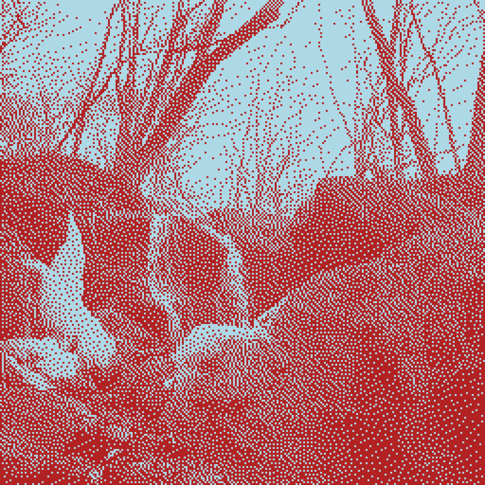

## [@dither.bot](https://www.instagram.com/dither.bot/) generates a random duo-tone dithered detail from my film photography archive.

#### In [image processing, dithering](https://en.wikipedia.org/wiki/Dither#Digital_photography_and_image_processing) creates the illusion of continuous shadings by varying the densities of pixels that are only either "on" or "off." It can be a cool effect at certain resolutions.

### sample post

### What's random?
- The light and dark colors, randomly chosen from a list
- The source film image
- The section cropped of the source image
- The size of the crop, dithered and resized to 256x256 "pixels."

### What's controlled?
- The light and dark colors are subsets of the [named colors](https://github.com/python-pillow/Pillow/blob/12028c9789c3c6ac15eb147a092bfc463ebbc398/src/PIL/ImageColor.py) recognized by the Python Imaging Library fork [Pillow](https://github.com/python-pillow/Pillow/tree/12028c9789c3c6ac15eb147a092bfc463ebbc398), itself based on [CSS's named colors](https://drafts.csswg.org/css-color-4/#named-colors). I culled for light/dark contrast, colors I found pretty, and redundancy (sooo many off-whites.)
- The source photos are a small subset of all the film I get developed and scanned, culled for hopefully interesting subjects, shapes, and textures in an arbitrary crop.

### What's automatic?
- `ditherer.py` is run via [cron job](https://en.wikipedia.org/wiki/Cron) on my laptop every 5 hours, overwriting a fresh image and caption in `to_post/`. This folder is synced to my Dropbox account.
- Every morning, a [Shortcut](https://apps.apple.com/us/app/shortcuts/id915249334) on my phone reads the image from Dropbox, opens Instagram, prompts me to post the image, and copies the caption value in `caption.json` to my phone's clipboard.

The small gap in automation (requiring me to paste a caption and tap Post) is due to Instagram's crackdown on bots with automated login and posting scripts.

### Inspired by:
- [Low-Tech Magazine](https://solar.lowtechmagazine.com/2018/09/how-to-build-a-lowtech-website/)'s principles and aesthetic.
- Gameboy graphics
- 1-bit art
